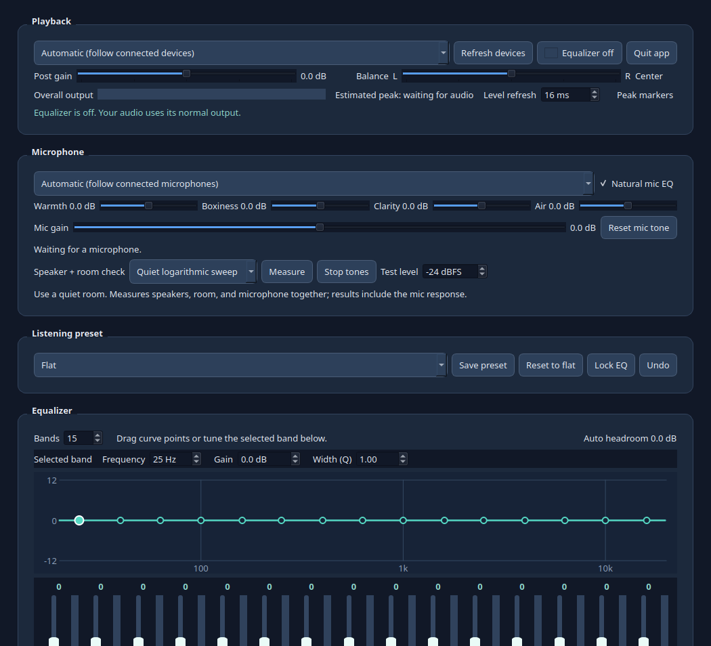

# SoundCurrent EQ

SoundCurrent EQ is a native C++ desktop equalizer for Linux systems using
PipeWire. It gives every app that plays through the default output the same
adjustable sound profile. It starts with 15 frequency bands, lets you choose
any count from 5 to 31, and opens with **Flat** selected. Each band has its own
gain, center frequency, and width (Q). The app also has 34 listening presets,
saved custom profiles, a post-gain slider, stereo balance, and live level
indicators. A connected mono or stereo microphone can use a separate natural
voice EQ with editable tone and gain controls.
The window fits within the available desktop area. A speaker and room check can
play a logarithmic sweep and preview conservative playback EQ adjustments.



## How listening works

When the equalizer is on, SoundCurrent EQ creates a PipeWire filter. On current
WirePlumber systems, audio to the selected physical output passes through the
filter while that output remains the system default. The system volume then
applies once, at the physical output. On older WirePlumber systems, the app uses
a virtual default output and keeps its volume in sync with the physical output
so the two do not reduce the signal twice. Audio passes through automatic
headroom, the adjustable EQ bands, post gain, and left/right balance. The
**Automatic** device setting follows newly connected outputs, while the dropdown
lets you pin a specific device.

The EQ curve shows what the frequency settings do. Colored indicators next to
the sliders show a live estimate of the sound level near each frequency. The
**Overall output** bar shows the estimated peak after post gain and balance;
teal, amber, and red show increasing clipping risk. Set **Level refresh** from
1 to 100 ms (16 ms by default), and turn on **Peak
markers** to see a falling peak hold line on each indicator, including the
overall bar. Peak markers start off; both choices are remembered. The timer
uses precise scheduling, but
actual display updates depend on when PipeWire supplies new audio. Very short
intervals use more CPU. The peak readout turns amber or red as the estimated
output approaches clipping.
Boosting bands can lower overall loudness because the app makes room for those
boosts; **Post gain** lets you bring the level back up. Its slider runs from
-12 to +12 dB in 0.5 dB steps, starts at 0 dB, and remembers your adjustment.
The **Balance** slider moves toward L or R by reducing the opposite channel.
Center preserves both channels at full level, and either end mutes the opposite
channel. It also remembers your setting. The indicators are estimates, so listen
for audible distortion as well as watching the display.

Click the framed **Equalizer on/off** control to compare with normal audio.
Closing the window keeps the EQ running in the background. **Quit app** unloads
it and restores the normal output. PipeWire's built-in filters perform the
audio processing; the C++ app manages the controls, devices, and level display.

## Install

Download the package for your system from the [latest release](https://github.com/rhamenator/soundcurrent-eq/releases/latest).

### Ubuntu 24.04 and newer

1. Open the `.deb` in Ubuntu's package installer, or run:

   ```bash
   sudo apt install ./soundcurrent-eq_*.deb
   ```

2. Launch **SoundCurrent EQ** from the app menu. The equalizer starts on using
   the current output device. Choose **Automatic** or a specific output device.

The package declares its dependencies so `apt` installs the required Qt and
PipeWire tools. The Ubuntu package targets 64-bit Ubuntu 24.04 LTS and newer
with PipeWire audio.

### Fedora 44 and RHEL 10

Choose the `.fc44.x86_64.rpm` file for Fedora 44, or the `.el10.x86_64.rpm`
file for RHEL 10. Install it with the desktop package manager or run:

```bash
sudo dnf install ./soundcurrent-eq-*.rpm
```

The RHEL 10 package is built in AlmaLinux 10, which targets RHEL 10 binary
compatibility. It has been checked for package dependency resolution and the
Qt interface in that environment; the live audio test still requires a desktop
PipeWire session. RHEL 9 is not a target for this package.

Each package has a `.sha256` checksum file. Download it alongside the package
and run `sha256sum -c <package-name>.sha256` before installing.

For a user-only install when the runtime dependencies are already present:

```bash
./scripts/install-user.sh ./soundcurrent-eq_*.deb
```

This extracts the package under `~/.local/share/soundcurrent-eq` and creates a
launcher in `~/.local/share/applications`. It does not use administrator access
or install missing dependencies.

## Use

- **Automatic** starts with the current default output. When a new output is
  connected, it switches to that device. If it disappears, it falls back to an
  available output. Choose a named device to keep the EQ on that device.
- Set **Bands** anywhere from 5 to 31. The current EQ shape is interpolated
  when the count changes, so your tuning is retained. The default is 15 bands.
- Move a slider or drag a point on the curve to adjust gain. Select a band and
  edit its center frequency, gain, or Q in the fields above the curve. Keyboard
  navigation works on the sliders and fields. Changes apply immediately without
  restarting the filter. Post gain and balance update immediately too.
- Boosts automatically lower the preamp using the calculated combined response
  to leave headroom. If playback is too quiet, move **Post gain** right in 0.5 dB
  steps. It acts after the EQ and is saved for the next launch. The default is
  0 dB; raising it can clip loud source material.
- Pick a built-in preset or save your own. Custom presets live in your user
  configuration directory. Saved nine-band presets from earlier releases can
  still be loaded.
- Use **Lock EQ** to protect playback presets, bands, post gain, and balance
  from accidental edits. The lock is remembered when the app restarts. **Undo**
  or Ctrl+Z restores the previous playback setting; repeated changes while
  dragging one control count as one step. The last 50 steps are available while
  the app is open. Rolling the mouse wheel over EQ sliders or number fields
  scrolls the window toward the level indicators instead of changing sound.
- The scrollable preset list includes Deep Bass, Podcast, TV Dialogue,
  FPS Footsteps, Rock, Jazz, Electronic, Hip-Hop, Night Listening, Loudness, and more.
  Separators divide the list; every named entry is a working preset.
- **Loudness** applies a fixed bass and treble contour for quiet listening, like
  the loudness controls on older receivers. It does not change with the volume.
- Colored bars beside the band sliders show estimated post-EQ levels from a
  live, local spectrum sample. A 4096-point FFT uses overlapping audio windows
  and checks for new audio at the chosen refresh interval while the window is
  open. Teal means ordinary activity, amber approaches
  full scale, and red suggests clipping risk. The peak text uses the same
  colors. These are estimates based on the EQ input and current settings; they
  do not measure the DAC or guarantee that every transient is caught.
- Closing the window keeps the equalizer running. Use its indicator icon to
  reopen it or turn processing on or off. **Quit app** unloads it and restores
  normal output. Launching the app again reopens the existing window. If the
  desktop has no tray, closing the window exits and restores normal output.
- Click the framed **Equalizer on/off** control to compare the processed sound
  with the normal output.

### Microphone

The **Microphone** section selects a connected input automatically, including
USB webcams with microphones. Its **Natural mic EQ** switch starts on when an
input is present. You can pin a specific input from the dropdown or turn the
mic EQ off without changing the playback EQ. A gentle 80 Hz high pass filter
reduces rumble; warmth, boxiness, clarity, and air have modest starting values.
Each slider adds or removes up to 12 dB from that starting value, in 0.5 dB
steps. **Mic gain** also ranges from -12 to +12 dB. Changes take effect while
the mic is in use, and **Reset mic tone** returns to the starting profile.

The starting profile is a voice-oriented suggestion, not an automatic acoustic
measurement of your microphone or room. Listen to a recording or call test and
adjust the controls for your mic. The app handles mono and stereo capture; a
mono webcam cannot provide left/right position information for room-following
balance. On current WirePlumber systems, the microphone filter is transparent
to recording apps. Older systems use a virtual default microphone while the
filter is active and restore the prior input when it stops.
The status line reports when the selected microphone disconnects. If only an
onboard input remains, it also says that no USB microphone is detected.

### Speaker and room check

Place the microphone near your usual listening position and use **Measure** in
the Microphone section. The default test starts with a short 20 Hz hold, then
sweeps logarithmically from 20 Hz to 25 kHz over ten seconds. It analyzes 20,
40, 63, 125, 250, 500, 1000, 2000, 4000, 8000, 16000, and 20000 Hz. You
can choose separate tones instead. Both test signals fade in and out. The test
level starts at -24 dBFS and can be adjusted from -54 to -5 dBFS. Start at a
comfortable level and use **Stop tones** if needed. The microphone filter
pauses during the check and resumes afterward.

The app samples room noise before playback and ignores frequencies it cannot
hear clearly above that noise. A quiet room gives a more useful result; pause
other audio while measuring. The preview shows each measured frequency and
limits its suggested change to 3 dB. **Apply suggested EQ** makes the changes
immediately; **Keep current EQ** discards them. Use **Save preset** to retain
an applied result. The measurement includes the combined response of the
speaker, amplifier, room, and microphone. It cannot separate the microphone's
own frequency response, so listen and adjust the result to taste. The generated
signal and capture stream use 96 kHz, but hardware running at 48 kHz may filter
out the end of the sweep near 25 kHz. The EQ itself has no 25 kHz band, and the
app makes no adjustment above its 20 kHz limit. Very low or high frequencies
may also be unmeasurable with a small speaker or webcam microphone; the app
leaves those frequencies unchanged.

**Hardware note:** An equalizer changes the audio signal. It will not repair a
physical output that pops when its amplifier powers up. Select a different
output in the dropdown if one device has that behavior.

## Build from source

```bash
sudo apt install cmake ninja-build g++ qt6-base-dev pipewire pipewire-bin pipewire-pulse wireplumber pulseaudio-utils
cmake -S . -B build -G Ninja -DCMAKE_BUILD_TYPE=Release
cmake --build build
./build/soundcurrent-eq
```

Build an installable package:

```bash
./scripts/build-deb.sh
```

The Ubuntu package and checksum appear in `dist/`. To build an RPM on Fedora or
RHEL, install `cmake`, `gcc-c++`, `qt6-qtbase-devel`, `rpm-build`, `tar`, and
`gzip`, then run `./scripts/build-rpm.sh`. RPM files and checksums appear in
`dist/x86_64/`. The GitHub release workflow builds Ubuntu, Fedora 44, and
RHEL 10 compatible packages for each `v*` tag.

## Verify the interface and audio routing

```bash
./build/soundcurrent-eq --self-test
QT_QPA_PLATFORM=offscreen ./build/soundcurrent-eq --ui-self-test
python3 tests/audio_response.py ./build/soundcurrent-eq
./build/soundcurrent-eq --mic-self-test
```

The first command briefly creates the EQ sink, changes its band count and
controls, and checks that the original default output and volume are restored.
It uses the
currently selected physical output and does not play a test sound. The second
checks the 31-band interface, preset library, lock and Undo, wheel scrolling,
selected-band controls, window fit, and calibration analysis without using audio.
The third command sends tones through a temporary silent sink and verifies
that a 12 dB band cut changes the measured output by about 12 dB and that
Night Listening reduces low-frequency output, Loudness emphasizes bass over
midrange, and +6 dB output gain raises the measured output by about 6 dB.
It requires `paplay` and `parec`, and leaves the normal default output alone.
The microphone check uses the selected input without saving audio and verifies
that its filter connects and accepts live changes. It restores the prior input.

## Privacy and safety

The app has no account, network service, or telemetry. It runs without root and
keeps temporary audio configuration in a private directory. The level display
reads the local EQ sink and does not save audio. The microphone filter processes
capture audio locally and does not record it to disk. Speaker measurement holds
microphone samples in memory; the generated sweep or tones are temporary files
deleted after the test. The `.deb` installs the binary,
launcher, icon, and license files. See [SECURITY.md](SECURITY.md) for
vulnerability reporting.

## How it works

The filter uses PipeWire's [filter-chain module](https://docs.pipewire.org/page_module_filter_chain.html)
with built-in biquad filters. Device routing is controlled through PipeWire's
PulseAudio compatibility tools. [Easy Effects](https://github.com/wwmm/easyeffects)
is a more advanced alternative if you need compression, convolution, or a large
plugin collection.

Licensed under [GNU GPL version 3 only](LICENSE). SoundCurrent EQ is an
independent project and is not affiliated with FxSound. Its adjustable EQ
workflow was informed by
[FxSound's public documentation](https://github.com/fxsound2/fxsound-app/blob/main/docs/COMMAND_LINE_OPTIONS.md);
no FxSound code or artwork is included.
